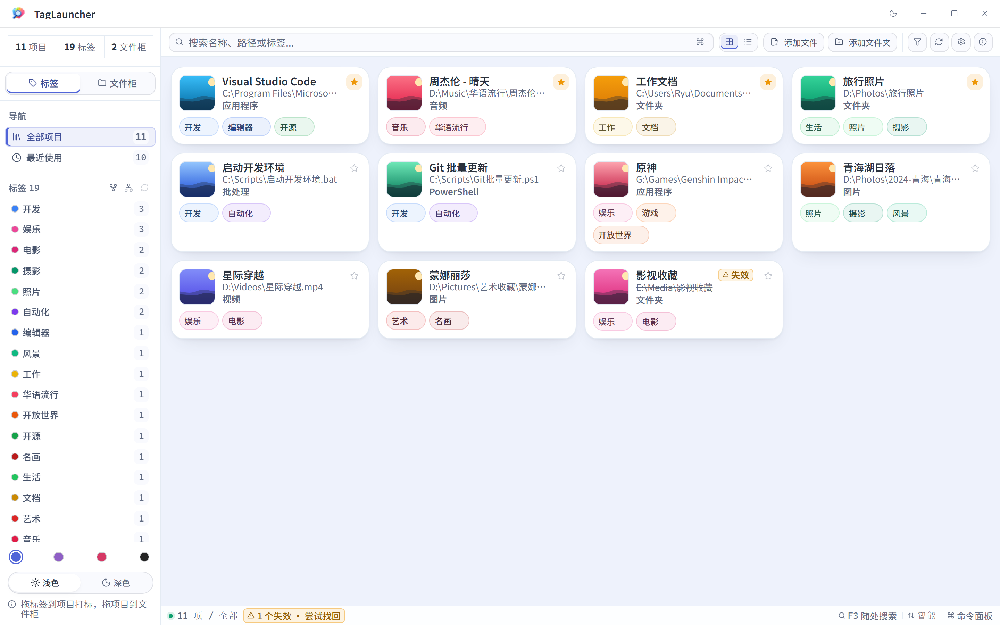
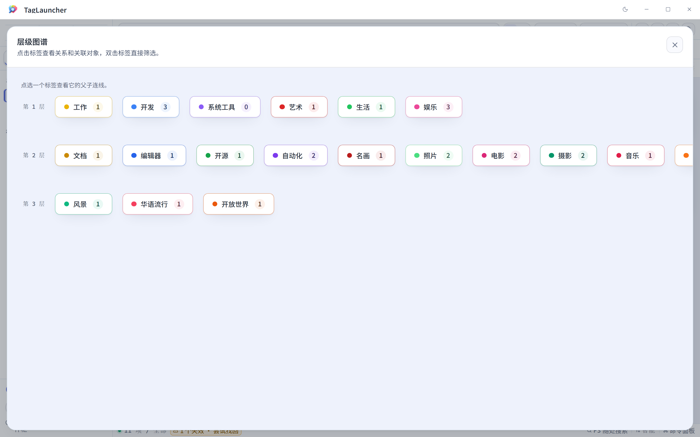
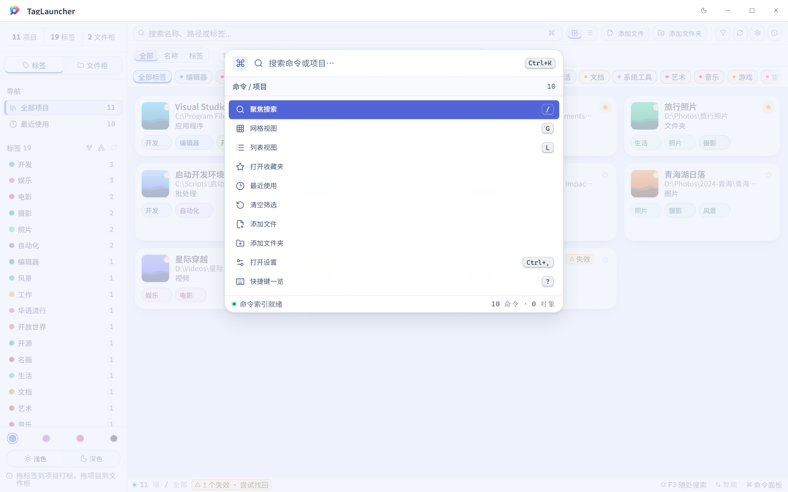

<div align="center">

# TagLauncher

**现代 | 轻量 | 极速 | 标签化管理**

标签式文件管理器与启动器:把本地文件、文件夹、脚本、程序、图片、音视频按「标签 + 文件柜 + 收藏」组织,快速搜索、一键启动。

[](https://github.com/KatouRyuuji/TagLauncher/releases)
[](https://github.com/KatouRyuuji/TagLauncher/releases)
[](./LICENSE)
[](https://github.com/KatouRyuuji/TagLauncher/actions/workflows/ci.yml)

[](https://github.com/KatouRyuuji/TagLauncher/stargazers) · [Star 趋势](https://star-history.com/#KatouRyuuji/TagLauncher&Date)

</div>

---

## 界面一览

<!-- 以下均为真实截图(2880×1800,建议展示宽度 1280×800);如需替换,保持同名文件即可 -->

<p align="center">
  
</p>

<p align="center">
  &nbsp;&nbsp;
  
</p>

<p align="center"><sub>主界面 · 标签关系图谱 · 命令面板（均为霜靛亮色）</sub></p>

## 核心亮点

| | | |
|:---:|:---|:---|
| 🧭 | **文件身份追踪** | 以 NTFS 文件 ID 为身份,改名、同盘移动自动追踪;跨盘移动按内容指纹自动找回;支持 NAS / 网络盘。 |
| 🕸️ | **图状标签(DAG)** | 标签多父继承构成有向无环图:选中「水果」自动包含「苹果」;侧栏支持分组折叠,并提供关系编辑器与可视化图谱。 |
| 🧩 | **Mod + 主题双体系** | CSS / CSS+JS / Theme 三类 Mod,17 种权限管控与网络请求原语;4 大配色家族(霜靛 / 藤色 / 樱花 / 素墨)× 亮/暗模式,以中性工作区承载家族强调色。 |
| 🤖 | **AI 自动打标** | 兼容 Anthropic 协议(可接第三方地址),一键 / 自动打标;密钥只存本机,导出自动剔除。 |
| 🖥️ | **CLI / MCP 原生集成** | 随附 `tl` 命令行(全功能 + JSON 输出)、`tl tui` 终端界面、`tl mcp` MCP 服务——AI 客户端可直接搜索 / 启动 / 整理你的对象库。 |
| 🔒 | **数据主权** | 全部本地存储;WebDAV 云备份脱敏(保留最近 10 份);自定义数据目录,一键备份 / 导出 / 导入。 |

> 另有商业级交互(大列表虚拟化、命令面板、空格预览图片/音频/视频、框选、关键词高亮)与在线更新(x64 / ARM64 双架构安装包,启动自动检查、24h 节流)。工程数据:**95 个后端命令 · 300+ 自动化测试全绿 · CI + tag 触发双架构发版流水线**。

## 快速开始

### 我是用户

1. 前往 [Releases](https://github.com/KatouRyuuji/TagLauncher/releases) 下载最新版本(按设备选择 x64 或 ARM64):
   - **安装包**(NSIS,约 14 MB):`..._x64-setup.exe` / `..._arm64-setup.exe`;
   - **便携版**(单 exe zip,解压即用,可放 U 盘):`..._x64-portable.zip` / `..._arm64-portable.zip`。
2. 安装包:运行安装程序,可选桌面快捷方式,安装语言支持 English / 简体中文;便携版:解压后运行 `tag-launcher.exe`(数据存放在用户数据目录 `%LOCALAPPDATA%\TagLauncher\Save\`,与解压位置无关,换版本不丢数据)。
3. 启动后拖入文件或文件夹,贴标签、归档、一键启动。

### 我是开发者

新设备双击仓库根目录的 `setup.bat`,自动检测并安装 Node.js、Rust、VS C++ Build Tools、WebView2 并完成 `npm install`;随后:

```bash
npm run tauri dev      # 桌面开发模式
npm run test:all       # 全量测试(tsc + 前端 + vitest + Rust)
npm run tauri build    # 打包 Release(NSIS 安装包)
npm run pack:portable  # 打便携版 zip(单 exe;build.bat 会在构建后自动完成)
```

环境要求:Windows 10 / 11(x64 或 ARM64)· Node.js 20+ · Rust stable · Visual Studio C++ Build Tools · WebView2 Runtime。

## 功能总览

<details>
<summary><b>对象与身份</b></summary>

- 添加文件、文件夹、脚本、程序、图片、音频与视频,支持批量导入、启动对象、打开所在文件夹。
- 视频对象自动识别类型并显示系统首帧缩略图,快速预览可直接播放;快捷方式(.lnk)图标取自目标、不带箭头角标。
- 以「卷序列号 + 文件 ID」识别对象:重命名 / 同盘移动自动追踪;跨盘移动以内容签名兜底重定位;删除 / 离线标记失效但保留归类。
- 支持 UNC 路径与映射网络盘;NTFS 文件 ID 不可用时自动回退按路径管理;符号链接按目标语义处理。
- 文件柜归类(一对象可入多柜)、收藏夹置顶、最近使用集合;缩略图可手动设置 / 更换 / 清除。
</details>

<details>
<summary><b>标签系统(图状层级)</b></summary>

- 标签 CRUD、多标签交集筛选(正选 AND)+ 右键反选排除(灰色删除线态)、拖拽打标、对象内标签重排与移除。
- 标签可多父继承构成 DAG,选中父标签自动并入其所有后代对象。
- 独立关系编辑器与图谱视图,层级展示父子关系。
</details>

<details>
<summary><b>搜索与交互</b></summary>

- 搜索覆盖名称、路径、标签、拼音、拼音首字母、英文轻度容错、英文缩写与同义词,支持表达式语法,150ms 防抖,关键词高亮。
- 网格 / 列表双视图均虚拟化渲染(@tanstack/react-virtual);五种排序(智能 / 名称 / 最近 / 添加时间 / 类型)并记忆偏好。
- 命令面板(Ctrl+K)、空格快速预览、鼠标框选(Alt+框选减选)、批量操作工具条、右键菜单完整键盘可达。
- 键盘优先:`/` 聚焦搜索,方向键 / Home / End / 翻页选择,Enter 启动,Ctrl+C 复制路径,Ctrl+D 收藏,`?` 查看快捷键;中文输入法组字不误触。
- 自定义主题化窗口栏、首屏骨架屏、空态引导文案。
</details>

<details>
<summary><b>Mod 与主题</b></summary>

- 三类 Mod:CSS、CSS+JS、Theme;提供权限管控(17 种)、生命周期、工具栏按钮、侧栏 / 浮动面板、卡片与列表行对等插槽、Mod 数据存储、文件读写。
- 受约束的网络请求原语(net.fetch,经 Rust 后端代理绕 CORS)与只读标签关系接口。
- 主题系统:4 大内置配色家族(霜靛 / 藤色 / 樱花 / 素墨),以中性画布、表面和文字层级搭配家族强调色;亮 / 暗为独立开关(可跟随系统),主界面可快速切换。另支持自定义 JSON 主题、Mod 主题,导入 / 导出 / 刷新;应用等待主题就绪后再显示主窗口,避免启动闪烁。
- 字体方案:UI 与阅读文字使用 Noto Sans SC,等宽信息使用 Cascadia Code,均为本地打包字体。
</details>

<details>
<summary><b>AI 自动打标</b></summary>

- 填写兼容 Anthropic 协议的 API 地址、密钥与模型(均需自行填写,无内置默认),即可一键为全部(或仅未打标)对象智能打标。
- 可开启「新对象自动打标」;支持限制标签数量、是否允许创建新标签、自定义打标偏好。
- 密钥仅存本机、不下发前端;导出 / 云备份自动剔除。
</details>

<details>
<summary><b>命令行与 AI 集成(tl)</b></summary>

- 安装包 / 便携版附带 `tl.exe` 命令行:搜索 / 启动 / 添加 / 移除 / 标签 / 收藏 / 文件柜 / 统计全功能,全命令支持 `--json` 输出。
- `tl tui` 终端交互界面(输入即搜索,Enter 启动,Ctrl+D 收藏);`tl mcp` 暴露 MCP 工具面,Claude Desktop 等 AI 客户端配置后即可驱动本应用。
- 与 GUI 共享同一 SQLite 库(WAL 并发安全);设置页「AI 集成」区块一键复制 MCP 配置;`skills/tag-launcher/SKILL.md` 为 AI 使用本应用的行为准则。
</details>

<details>
<summary><b>数据与同步</b></summary>

- 数据全部本地存储(SQLite WAL + FTS5);自定义数据目录(exe 旁 `datapath.json` 重定向)。
- 一键备份 / 导出 / 导入:SQLite 在线备份 API 生成页级一致快照,导入前自动备份可回退。
- WebDAV 云同步:群晖 / 威联通 / Nextcloud / 坚果云等,支持测试连接、立即备份、云端列表与一键恢复;自动云备份(启动时距上次超 24 小时触发);云端副本脱敏,远端保留最近 10 份。
</details>

<details>
<summary><b>更新与平台</b></summary>

- 启动自动检查 GitHub Releases(24h 节流、同版本只提醒一次);设置页可手动检查,按当前架构(x64 / ARM64)直达安装包下载。
- 安装包 NSIS 约 14 MB,另有单 exe 便携版 zip(解压即用);支持 Windows 10 / 11,x64 与 ARM64 原生双架构。
- 流水线:push / PR 触发 CI 全量测试;推送版本 tag 自动构建双架构安装包 + 便携 zip 并生成草稿 Release。
</details>

## 文档导航

| 文档 | 说明 |
|:---|:---|
| [使用手册](./USER_GUIDE.md) | 面向用户的完整功能说明 |
| [开发手册](./PROJECT_MANUAL.md) | 架构、模块与开发要点 |
| [Mod 开发指南](./MOD_GUIDE.md) | Mod 清单、权限与 JS API 完整参考 |
| [主题开发指南](./THEME_GUIDE.md) | 主题 JSON 字段与 112 键变量契约 |
| [源码开发指南](./TUTORIAL.md) | 从源码开始的开发教学 |
| [维护手册](./MAINTENANCE.md) | 测试、发版与维护流程 |
| [版本对比](./版本对比.md) | 1.0.0 → 1.8.0 代际升级记录 |

## Star History

<a href="https://www.star-history.com/?repos=KatouRyuuji%2FTagLauncher&type=date&legend=top-left">
 <picture>
   <source media="(prefers-color-scheme: dark)" srcset="https://api.star-history.com/chart?repos=KatouRyuuji/TagLauncher&type=date&theme=dark&legend=top-left&sealed_token=Geo4894px16_OyWAwwft6H4BqOZfv_6qXGe-ITYWhWluDq0MSTL3Pe5mAwfzv-NsjZ0tAdui-P6mk4Z6hJIXA89R8OFNtBCB3vnVlRZg7tfpFR-dVtv39ZerRb2Ddi2ASHsKUTkfhqs-8wWcBVxwLA8Ws0WqFgLG6-pCERumuhfT4lS0z9uvCgWt0p55" />
   <source media="(prefers-color-scheme: light)" srcset="https://api.star-history.com/chart?repos=KatouRyuuji/TagLauncher&type=date&legend=top-left&sealed_token=Geo4894px16_OyWAwwft6H4BqOZfv_6qXGe-ITYWhWluDq0MSTL3Pe5mAwfzv-NsjZ0tAdui-P6mk4Z6hJIXA89R8OFNtBCB3vnVlRZg7tfpFR-dVtv39ZerRb2Ddi2ASHsKUTkfhqs-8wWcBVxwLA8Ws0WqFgLG6-pCERumuhfT4lS0z9uvCgWt0p55" />
   
 </picture>
</a>

---

<div align="center">

**[MIT License](./LICENSE)** · Copyright (c) 2026 RyuuJi Soft

致谢:Tauri、React、Vite 及所有开源依赖的作者与社区

如果 TagLauncher 帮到了你,欢迎点亮一颗 Star

</div>
